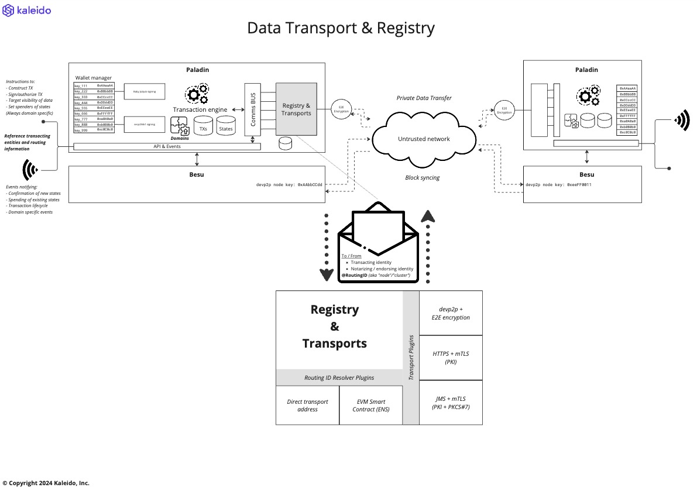

# Data Transports and Registry

Each Paladin runtime needs to share data privately with other Paladins, based on the identities that are transacting.

These message are frequent and occur as part of the [Distributed transaction manager](./transaction_manager.md) operation to coordinate the assembly and submission of transactions.

## Types of identity

There are two fundamental types of identity involved in Paladin:

### Account signing identities

These are able to sign transactions, and hold state/value.

Some are used at the Base EVM Ledger layer to submit transactions, and others are used during ZKP proof generation, or endorsement/notarization flows.

> These live for a long time, and are very complex to change

While Paladin supports many underlying technologies to manage the key materials and signing, there are some common attributes:

- A public key identifier
- A type of cryptography (sekp256k1, Baby Jubjub etc.)
- A logic association to an actual identifiable entity, which might or
  might not be disclosed to others in the network

A single Paladin runtime might manage thousands of these accounts, for different purposes. For example generating a new signing key to submit each traction to a blockchain for anonymous submission, or managing the keys for many different user accounts that all transact via that Paladin node.

### Runtime routing identities

For private data to be able to move securely between Paladin runtimes, a different form of identity is required for the endpoints.

> These are used only for data-in-flight. These must be able to change as infrastructure updates, and keys rotate, and they are bound only to runtime infrastructure (not the transacting entities themselves)

They provide transport-specific routing information:

- Transport support information
- IP addresses
- Hostnames
- Topic/queue names
- Transport encryption signing identities (PKI certificates)

A single Paladin runtime might expose multiple external connection transports for other Paladin nodes to connect to. However, those remote nodes must be able to establish securely that they are encrypting and transferring data to the right node.

## Routing and delivering private data

When constructing a transaction the signing identities of multiple parties might be involved:

- Initiator of the transaction
- Old owner(s) of the values/states being transferred/spent
- New owner(s) of the values/states being transferred/minted
- Endorsers of the transaction (notary / privacy group)
- Base EVM submission identity

For each of these parties there might be a need to:

- Route data to that party
- Request signing from that party
- Request submission from that party

Some of this information is provided explicitly by the initiator of the transaction, and others are determined by the Paladin node interacting with the privacy preserving smart contract module to orchestrate the transaction.

In each case the Paladin node needs to determine:
- Which account signing identity is involved
- Which runtime route to use to transfer the data

## Account & Routing Addresses

Paladin solves this problem by requiring each specification of a target identity to include **two parts**:

1. The `account identifier`: points to a signing account
    - An off-chain address book in each Paladin node allows mapping between arbitrary strings and the underlying address. This is covered in more detail in [Key Management](./key_management.md)
2. The `routing identifier`: points to a Paladin runtime
    - This is passed into a `registry` plugin to determine the right transport, physical address, and encryption details to use

## Registry plugin

> TODO: Details to follow (Lead: Gabriel Indik)

## Transports

Some fundamental architecture principals are applied to our transports, to allow the rest of the Paladin engine to be agnostic to which transport is used:

1. The transport interface is asynchronous event/message transfer
   - This does not prevent synchronous protocols like HTTP being used, but the HTTP request must not block waiting for processing. Rather, responses arrive via a later HTTP request in the other direction.
2. Resilience is encouraged, but not relied upon by Paladin
   - All requests over the transport are idempotent in nature, and will be retried by the Paladin in the case of error
3. Encryption must be end-to-end between Paladin runtimes
   - Where a hub+spoke transport model exists, such a a central JMS/Kafka message bus, or a multi-hop devp2p peering network, the data must be encrypted before it leaves Paladin, and not decrypted again until received by the final destination Paladin

> TODO: Details to follow (Lead: Sam May)
