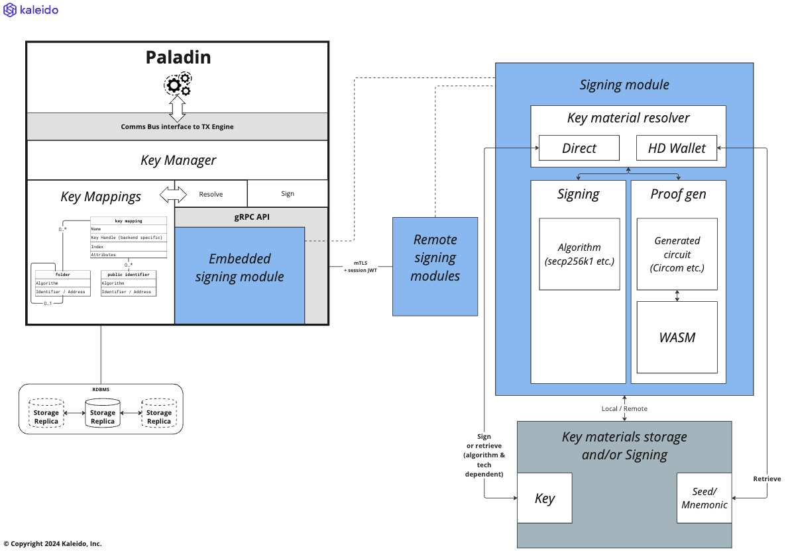

# Key Management

> TODO: Well established architecture already being brought across to Paladin here (Lead: Matt Clarke)

The architecture has the following core concepts:

## 1. Key Identifiers

When applications and configuration refer to keys, they can do so via string identifiers.

> See [Data & Registry](./data_and_registry.md) for details about the format of these identifiers
> and how they are resolved across separate Paladin runtimes. 

These identifiers can be human/application friendly strings describing the **purpose** of the key,
rather than needing to be one of the public-key identifiers (like an Eth `address`) that
represents that key with a particular signing algorithm (like `secp256k1`).

Key identifiers can be organized into folders, using a `/` character within the identifier.

This is useful for logical partitioning of keys owned by different entities, as well as being
used by the signing module to influence grouping of keys. For example to influence the derivation
path of keys in a BIP32 Hierarchical Deterministic (HD) Wallet.

## 2. Key Mappings

These are database persisted, and cached, records that the main Paladin runtime maintains that match
a `key identifier` to the `key handle` of that key in the signing module.

Key mappings have a reference to the folder they are in, which references its parent folder
all the way up to a single root folder that is pre-created by the Paladin runtime.

Key mappings also have `attributes` that can be specified when creating a key mapping explicitly
over an API, and are passed to the signing module when resolving the key. This allows the behavior of
the signing module when obtaining/creating key materials to be customized at runtime (within the 
constraints of that signing module).

Every `key mapping` and `folder` gets two attributes automatically:
- `name`: the part of the `key identifier` representing this key / folder
- `index`: a numeric identifier, assured to be unique at this folder level

## 3. Public identifiers and algorithms

In Paladin transaction signing can be complex, requiring multiple signatures, using
different algorithms, at different stages in the assembly, endorsement/proof and
submission of the transaction to the base blockchain.

An algorithm might be straight forward signing of a payload, such as `secp256k1`
signing, and maybe can happen natively inside a HSM device.

An algorithm might be domain specific, such as usage of a ZKP friendly cryptography
inside of the proof generator of a specific circuit generated in a toolkit like Circom.

Some of these algorithms have different ways to represent the same key materials,
and require distribution of those public identifiers to multiple parties during
the creation of endorsements/proofs of the transaction.

So Paladin has a scheme for identification of the `algorithm` for a signing/proof
generation request, and associating multiple `public identifiers` to the same
key materials.

## 4. Signing Modules

These are the engines that have direct or indirect access to key materials, and coordinate
signing and ZKP proof generation.

> Note that the key materials themselves are stored outside the signing module,
> in one of a number of places supported by those signing modules - such as
> Local disk (for dev), Cloud Key Managers, Cloud HSMs, Software key managers,
> and HSMs (supporting PKCS#11)

Paladin embeds a flexible implementation of the signing module into the runtime
with convenient access to key materials and signing algorithms.

Paladin provides this same code as a base implementation for running signing modules
outside the core runtime connected of a mutual-TLS secure connection, supplemented
with JWT credentials for each signing request that propagate context from the Paladin
runtime on the context of the signing.

## 5. Key resolution and creation of new keys on-demand

The resolution from a `key identifier` to a `key handle` happens dynamically, when a
suitable `key mapping` is not already found in the Paladin database.

The result of this resolution always ends up with a `key handle` that the signing module
produces that uniquely identifies that key inside of the signing module's cryptographic
storage (which is pluggable to many technologies).

However, the resolution result might end up with many possible outcomes.

For example:
- Returning the identifier of a key that already was pre-created in the cryptographic
  storage system, thus establishing a new `key mapping` to an existing `key handle`
- Instructing the cryptographic storage system to generate a brand new key, thus 
  on-demand creating a `key mapping` to a new unique key
- Allocating a unique derivation path in a Hierarchical Deterministic (HD) derivation
  path scheme like BIP32, that references a new unique key backed by an existing
  seed/mnemonic stored in the cryptographic storage system