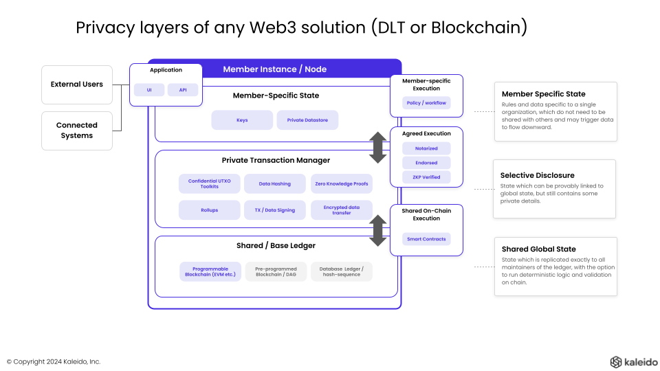

# Ledger Layers

When we consider the make up of a distributed ledger system that preserves privacy for those transacting on it, there are a necessary set of layers that are present in any implementation.

The Paladin project:
- Provides an enterprise grade runtime within the these layers can come together
   - So they can interoperate efficiently and thus a minimum viable ecosystem (MVE) can form
- Adopts EVM as the base shared ledger layer
   - Due to the amount of innovation already available from that ecosystem to build on
   - Because programmability in the base shared ledger is what enables atomic interop
- Brings in the latest approaches to privacy at the selective disclosure layer, for tokens
   - Zero-knowledge proof based systems
   - Notary/endorsement based systems
- Allows EVM to be used as a programming model for atomic interop scenarios like DvP
   - Combining the innovation of previous projects (e.g [Tessera](https://github.com/consensys/tessera)), with updated approaches to tokens

Let's discuss the layers in a little more detail.

## Shared Global State - the base shared ledger

This is the layer that is the most transformational component of Web3 technology, as it did not exist in the Web2 world.

A mutually agreed sequence of transactions, written to a shared ledger, trusted by all parties because the maintenance of that ledger is _shared_ across the parties validating that ledger.

When sub-ledger privacy is implemented on top of this ledger, there is a limit to what data can be store directly at this layer.

As such there are lots of different terms used in privacy-enabled Web3 stacks for this layer:

- Orderer - used in models when the only function of this layer is to order transactions pre-verified/endorsed by layers higher in the stack
- Synchronizer - used in models when the function of this layer is to collect endorsements that prepare a transaction, and record that finalization
- Blockchain - used in models where this layer is a fully programmable blockchain, where programmable transactions execute directly at this layer

> Note that in Orderer and Synchronizer based models, the amount of data/processing that happens in the shared ledger is quite limited. This has lead to many deployments of these models where these are *centralized* single-party infrastructure, running crash-fault-tolerant algorithms like RAFT or a traditional HA Database. Paladin does **not** take this approach.

### Paladin - EVM native approach to the shared / base ledger

Paladin is opinionated that the shared ledger should be:
- Fully decentralized with a Byzantine Fault Tolerant (BFT) consensus algorithm
    - So immutability, order and finality of transaction is trusted by all parties that use it as their shared ledger
- Fully programmable via EVM
    - So the different smart contracts can interoperate atomically
    - So open/public EVM smart contracts (ERC-20, ERC-721, ERC-1155 etc.) can fully interoperate with privacy preserving smart contracts
    - See [Atomic Interop of Privacy Preserving Smart Contracts](./atomic_interop.md) for more information
- Unmodified EVM
    - So that privacy preserving smart contracts can be deployed on top of any ledger that supports EVM
    - To uphold good separation of concerns with projects like Hyperledger Besu, avoiding roadmap conflicts that limit innovation

## Selective Disclosure - the private transaction manager

By definition when not all of the data is available directly in the shared / base ledger, there must be a layer of technology that sits above the ledger and is run by all parties in order for them to transact.

This layer has some core responsibilities:
- Distributed transaction coordination across parties
- Secure transfer of data
- Secure storage & retrieval of data that has been selectively disclosed
- Supporting the programming model of privacy preserving smart contracts
- Running the cryptography engines that generate the proofs/signatures needed by the base ledger layer

This engine is part of the protocol runtime stack, but it runs above the underlying ledger.

The Paladin project focusses on building an enterprise grade runtime for this layer, for the Enterprise EVM Stack.

### Paladin - modular and atomically interoperable privacy preserving smart contracts

Paladin takes a modular approach, instead of building around a single cryptographic engine, or implementing a high-level orchestration domain-specific language (DSL) for implementing orchestration and business logic.

Some guiding principals that influence the runtime engine architecture include:
- Supporting the current and future generations of Zero-knowledge Proof (ZKP) cryptography modules
- Supporting notary/issuer based pre-verification approaches, with equal priority to ZKP based approaches
- Supporting scalable tokens using a UTXO approach to managing fragmented private state
- Supporting EVM as a programming model for private smart contracts
- Supporting atomic interoperability between privacy preserving smart contracts of all types
- Supporting multiple private data transports, with enterprise qualities of service

Learn more about the [Paladin Runtime Architecture](./runtime_architecture.md).

## Member-specific state

All Decentralized Applications (DApps) in the enterprise space, require integration into security infrastructure, core systems, and core business processes.

For this reason a significant traditional Web 2.0 infrastructure layer is needed in order for each enterprise to manage their own private participation, the the digital assets they own.

This is a combination of application runtimes specific to individual DApps, and Middleware that facilitates core system integration, bridging, asset modelling and other high level functions.

Paladin does not implement this layer, but is designed to provide high performance enterprise friendly APIs, Event streams, and data query interfaces, to enable application code to be built rapidly, and middleware projects such as Hyperledger FireFly to build upon.