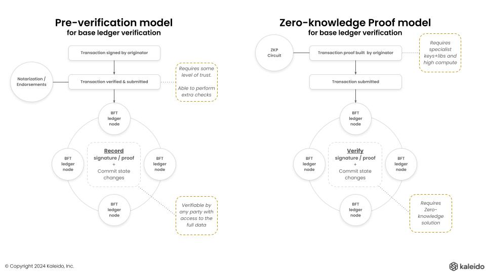
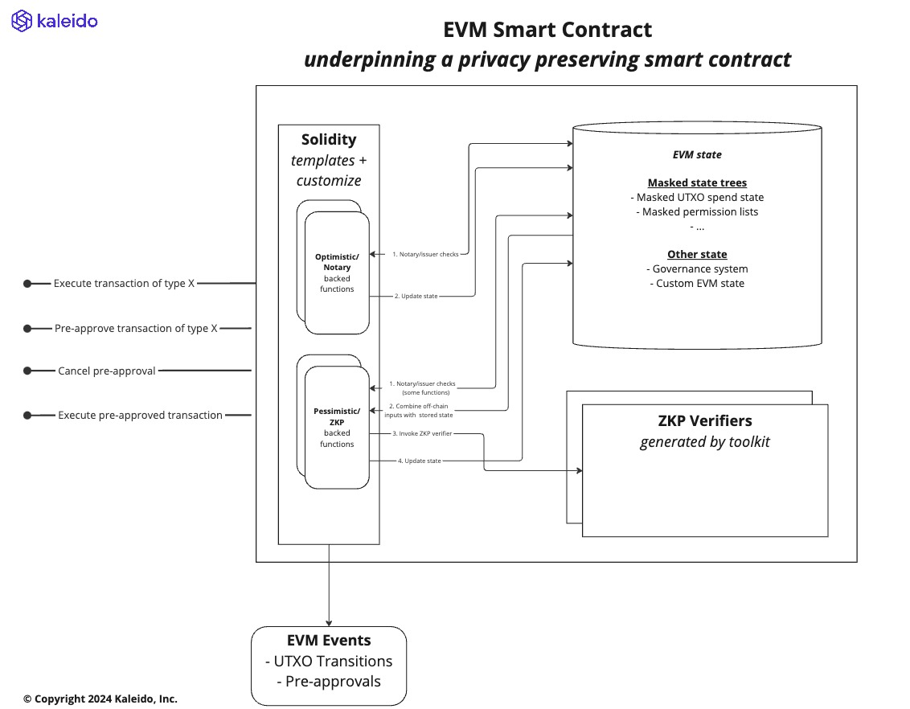
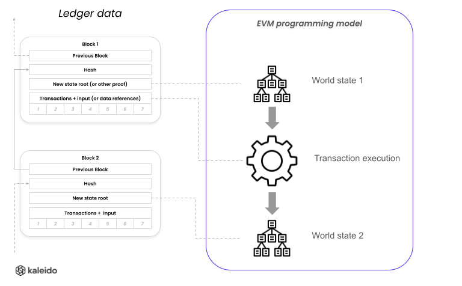

# Paladin programming model

There are three layers of programmability in Paladin for building privacy preserving smart contracts

## Layer A: Base EVM Ledger

Every privacy preserving smart contract is backed by an EVM smart contract, deployed onto the base EVM ledger. The base EVM can be a Hyperledger Besu network, or any EVM compliant ledger (permissioned or public).

The code that exists at this layer must not require access to the private data, while fulfilling fundamental responsibilities:

1. Ensuring every state transition is only finalized by the blockchain if it is validated:
    - By verifying a zero-knowledge proof, and/or that the transaction was pre-verified
2. Enforcing double-spend protections
    - We discuss later how and why a UTXO model is most common in private transactions
3. Conforming to an interface that allows atomic interop with other smart contracts
    - Learn more in [Atomic interop of privacy preserving smart contracts](./atomic_interop.md)

### ZKP verification, Notary and Endorsement models

Because the base ledger smart contract cannot access or leak the data involved in the transaction, there are two fundamental approaches to finalization of transactions.

1. The transaction is pre-verified off-chain before submission
    - The smart contract records the proof of the pre-verification, but cannot directly verify it
    - The identity of the verifier(s) are known and trusted by the parties transacting
    - The smart contract only allows spending by the authorized notary / endorsement-group
    - Example 1: the issuer of a particular tokenized deposit / digital asset
    - Example 2: the members of a privacy group signing off on every transaction (more on this later)
2. A zero-knowledge proof is verified during execution of the transaction
    - The smart contract uses advanced cryptography to verify the rules were obeyed
    - Anyone can submit a transaction, as long as it comes with a suitable proof
    - Example 1: a cash token with total conversation of value and ownership enforced via ZKP
    - Example 2: a non-fungible token with uniqueness and ownership enforced via ZKP

There are strong reasons why both of these approaches exist - some related to efficiency/performance, and others related to fundamental restrictions of either model. The Paladin project embraces this, and allows these two approaches to coexist and interoperate atomically.

The two approaches **can be combined** within a single smart contract, for example where simple transfers are allowed to be performed via ZKP alone, whereas onboarding/freezing trading identities, or minting, might require pre-verification.

Learn more in the [Privacy](./privacy.md) section.

### Base Ledger EVM development

You will need to develop/update EVM smart contracts at this layer, if you have requirements that are not met by existing EVM modules provided with the Paladin project.

Examples include:

- Making changes to a ZKP based token that require a new or modified circuit design
- Using a mixture of approaches, such as ZKP for transfer, and notary certificates for issuance
- Adding a completely new cryptography module to the Paladin project

The diagram below shows the fundamental anatomy of the EVM smart contract, with a mi

> TODO: Provide link to detailed developer guidance / samples / instructions

## Layer B: Private state and transaction management

Because the smart contract in the base ledger is privacy preserving, there must be code that
runs outside of the blockchain that is tightly coupled to the EVM code.

The two parts work in collaboration to implement the token.

- The off-chain part constructs and submits transactions, using private state
  - Selecting valid states for the transaction from off-chain data stores (wallet function)
  - Gathering endorsements / signatures
  - Pre-executing full transaction logic against the full data
  - Building proofs / notarization certificates as required
- The on-chain part finalizes transactions
  - The EVM smart contract is the source of truth of which state is valid
  - Double spend protection is performed with masked data / inclusion proofs
  - A proof is verified on-chain, or notary certificate is recorded on-chain

### Confidential UTXO models

By definition in a privacy preserving smart contract, the visibility/access to the data is fragmented - each party has a different visibility into the overall data being maintained on the ledger.

For this reason _globally_ maintained state (such as "accounts") are complex to maintain
in the selective disclosure layer. Instead, there is a trend towards treating the data in this layer as lots of independent immutable records of state (fragments of the overall state) that can be salted+hashed to uniquely identify them without disclosing their contents.

These states can encrypted and/or distributed selectively only to those parties with a right to see them, and spend them using an Unspent Transaction Output (UTXO) based execution model (built on top of EVM as a programmable ledger).

The UTXO model works extremely well for **tokens** - both fungible value, and non-fungible records of uniqueness and ownership. Because each fragment of value, or unique entry, exists independently and can be constructed into a transaction in isolation, there are benefits to:

- **Scale & performance**: Many transactions can be constructed concurrently by spending different values, without needing to lock/modify a single item (such as a target account balance)
   - This parallelism does require some complexity of transaction and state management that Paladin provides solves in a re-usable across privacy technologies, including ZKP and Notary based approaches
- **Programmability**: Complex transactions can be orchestrated on UTXO values that are locked of many different types, backed by different privacy mechanism
   - We will see in Layer C how EVM programmability can be layered back on top to aid complex stateful workflow on top of a C-UTXO model, for the token programmability layer required for token ecosystem use cases such as DvP

> Note that projects do exist (such as [Anonymous Zether](https://github.com/kaleido-io/anonymous-zether-client)) that implement tokens with an account model using advanced cryptography to protect global state. The Paladin architecture supports such models, although at time of writing no project has been onboarded.

### Programming interfaces for Layer B

Paladin provides a modular system for plugging in the off-chain half of your privacy preserving smart contract, if you are building a new one, or customizing one of the pre-built Paladin modules.

For more information see the following architecture pages:

- [Distributed Transaction Manager](./transaction_manager.md)
- [Runtime Architecture](./runtime_architecture.md)

## Layer C: Ecosystem programmability (Private EVM)

A special class of privacy preserving smart contract, is one that is designed to provide a layer of programmability _between other privacy preserving smart contracts_.

What better programming model to enable for such programmability, than EVM itself:
- Solidity and/or Vyper smart contracts, compiled to standard EVM without modification

### EVM blockchain programming model

If we recap on the fundamental programming model of an EVM based blockchain, we see it moves a single world state forwards in a set of blocks.

### EVM Private Smart Contracts in Privacy Group

The same programming model can be replicated many times in a privacy preserving way on a single base ledger, by having a chain of transactions shared within a **privacy group**.

As long as all parties of the privacy group pre-verify and endorse **all transitions on a private smart contract** (a simple 100% endorsement form of consensus) the transitions can be finalized by the blockchain using UTXO states.

- Private smart contracts exists uniquely within the privacy group
- The transactions are confirmed by spending UTXO states on the base EVM ledger
- The data required for each transition is confidential
- These state transitions can be verified as part of atomic transactions with other tokens

This is an evolution of the model provided Tessera, and is described in more detail in the [Pente](./pente.md) architecture section. Including the modes of interaction between private smart contracts executing in the private EVM.

## Putting it all together: DvP and other use cases

With these three layers of programmability, we now have the tools to provide EVM programming of DvP and other complex use cases, on top of tokens, on top of a single shared EVM ledger.

This is because the most powerful aspect of an EVM based privacy stack is that different privacy preserving smart contracts of different types can interoperate atomically on a **single shared EVM ledger**.

For example the following three different privacy preserving smart contracts can coordinate in a single atomic transaction:
1. A fungible ZKP verified token, such as a cash token
   - All transactions trusted by all parties in the cash token ecosystem
2. A non-fungible notary verified token, such as a bond certificate
   - All transactions trusted by all parties in the bond token ecosystem
3. A fully programmable EVM private smart contract
   - Transactions only trusted by parties within the privacy group

Each requires a different set of proofs/signatures to execute, but the finalization of all of these can happen in single transaction.

Learn more in [Atomic interop of privacy preserving smart contracts](./atomic_interop.md)