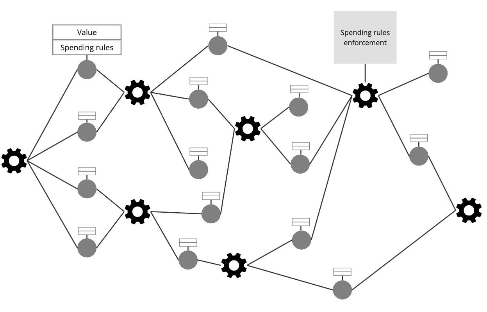

### Transaction assembly (wallet functions)

In order to assemble a valid transaction, smart contract specific code is required to select some private data in the state originator of the transaction, into .

Often referred to as known as "coin selection" logic.

This logic runs in the security context of the originator, and requires access to signing
keys that prove authority to initiate the business transaction.

Blockchain transaction consumes existing states, and produces new ones.

> Don't worry - the EVM model for state will come back in Layer C, where we define
> "privacy groups" within which programmable workflows share state/

