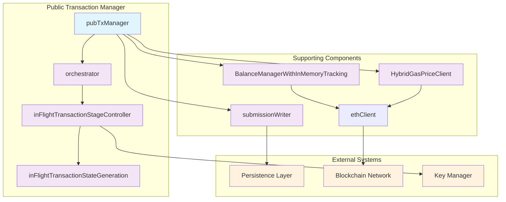
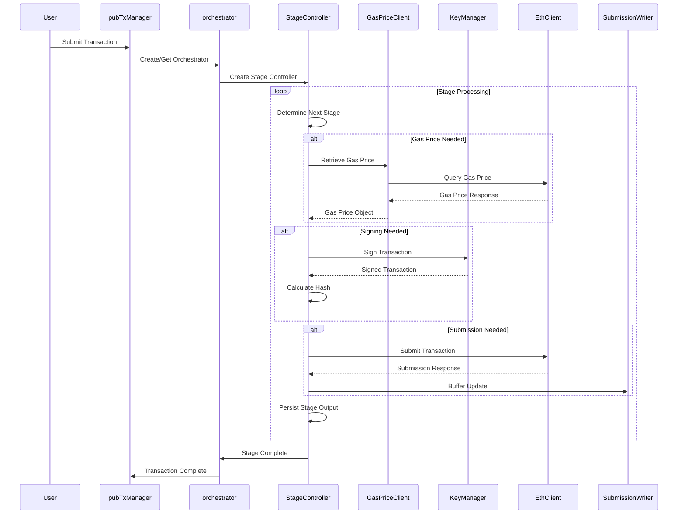
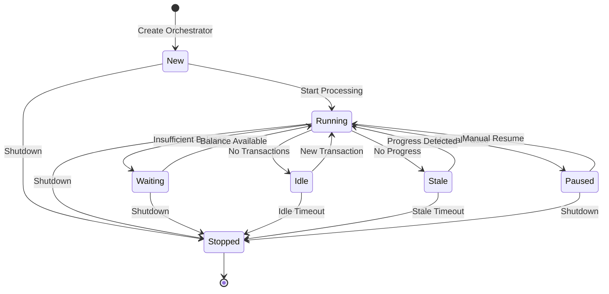

# Public Transaction Manager Architecture

## Overview

The Public Transaction Manager (`publictxmgr`) is responsible for signing and submitting public transactions onto configured blockchains. It implements a sophisticated multi-stage pipeline with retry mechanisms, balance management, and concurrent processing capabilities.

### Big Picture

**What Problem Does This Solve?**

The Public Transaction Manager addresses the complex challenge of reliably submitting transactions to blockchain networks. In blockchain applications, transaction submission involves multiple failure points:

- **Gas Price Volatility:** Network congestion can cause gas prices to fluctuate rapidly
- **Network Instability:** Blockchain nodes may be temporarily unavailable
- **Balance Management:** Insufficient funds can cause transaction failures
- **Concurrent Processing:** Multiple transactions from the same address require proper nonce management
- **Transaction Updates:** Users may need to modify transaction parameters before submission

**Basic High-Level Flow:**

1. **Transaction Submission:** User submits a transaction with target address, value, and data
2. **Orchestrator Assignment:** System assigns transaction to an orchestrator for the signing address
3. **Stage Processing:** Transaction moves through stages: Gas Price Retrieval → Signing → Submission
4. **Persistence:** Each stage result is persisted to maintain transaction state
5. **Monitoring:** System monitors transaction confirmation on the blockchain
6. **Completion:** Transaction is marked complete once confirmed or failed

The system handles failures gracefully through retries, fallbacks, and state preservation, ensuring transactions are eventually processed successfully.

## Component Architecture

### Component Diagram



### Transaction Lifecycle Sequence Diagram



### Orchestrator State Diagram



## Core Components and Structs

### 1. Main Manager (`pubTxManager`)

The central orchestrator that manages the entire transaction processing system.

**Key Responsibilities:**
- Manages orchestrator lifecycle (create, pause, resume, delete)
- Handles external transaction status change requests
- Provides shared gas price optimization
- Controls orchestrator pool size and limits

**Key Fields:**
```go
type pubTxManager struct {
    // Orchestrator management
    inFlightOrchestrators       map[pldtypes.EthAddress]*orchestrator  // Maps signing addresses to their orchestrators
    signingAddressesPausedUntil map[pldtypes.EthAddress]time.Time      // Tracks addresses paused until specific time
    inFlightOrchestratorMux     sync.Mutex                             // Protects concurrent access to orchestrator maps
    
    // Configuration
    conf                        *pldconf.PublicTxManagerConfig         // Main configuration object
    orchestratorIdleTimeout     time.Duration                          // Timeout for removing idle orchestrators
    orchestratorStaleTimeout    time.Duration                          // Timeout for removing stale orchestrators
    orchestratorSwapTimeout     time.Duration                          // Timeout for forcing orchestrator replacement
    
    // Dependencies
    ethClient                   ethclient.EthClient                    // Blockchain client for network operations
    gasPriceClient              GasPriceClient                         // Client for gas price retrieval
    balanceManager              BalanceManager                         // Manager for balance tracking
    submissionWriter            *submissionWriter                      // Writer for persisting transaction updates
}
```

**Code Mappings:**
- **Primary File:** `transaction_manager.go`
- **Key Methods:** `Start()`, `Stop()`, `SubmitTransaction()`, `UpdateTransaction()`, `engineLoop()`

### 2. Transaction Orchestrator (`orchestrator`)

Each signing address has its own orchestrator that manages transactions for that address.

**Key Responsibilities:**
- Polls for new transactions for a specific signing address
- Processes transactions through stages at configured intervals
- Manages nonce allocation and balance checking
- Handles stale transaction detection and cleanup

**Key Fields:**
```go
type orchestrator struct {
    signingAddress              pldtypes.EthAddress                    // Address this orchestrator manages
    orchestratorPollingInterval time.Duration                          // How often to poll for new transactions
    inFlightTxs                 []*inFlightTransactionStageController  // Currently processing transactions
    state                       OrchestratorState                      // Current state (Running, Waiting, etc.)
    
    // Balance and nonce management
    hasZeroGasPrice                    bool                            // Whether this chain uses zero gas price
    unavailableBalanceHandlingStrategy OrchestratorBalanceCheckUnavailableBalanceHandlingStrategy  // How to handle balance unavailability
    nextNonce                          *uint64                        // Next nonce to use for transactions
    lastNonceAlloc                     time.Time                      // When nonce was last allocated
}
```

**Code Mappings:**
- **Primary File:** `transaction_orchestrator.go`
- **Key Methods:** `orchestratorLoop()`, `processInFlightTransactions()`, `pollForNewTransactions()`

### Orchestrator State Management

The orchestrator operates through various states that reflect its current operational mode and health:

**State Transitions:**
- `OrchestratorStateNew`: Created but not started
- `OrchestratorStateRunning`: Normal operation, processing transactions
- `OrchestratorStateWaiting`: Waiting for preconditions (e.g., insufficient balance)
- `OrchestratorStateStale`: No progress for configured timeout
- `OrchestratorStateIdle`: No transactions to process
- `OrchestratorStatePaused`: Manually paused by external request
- `OrchestratorStateStopped`: Shutdown, removed from active pool

**State Transition Triggers:**
- **New → Running:** Orchestrator starts processing
- **Running → Waiting:** Insufficient balance or other preconditions not met
- **Running → Idle:** No transactions in queue
- **Running → Stale:** No progress for `orchestratorStaleTimeout`
- **Running → Paused:** Manual pause request
- **Any → Stopped:** Shutdown or timeout conditions
- **Waiting → Running:** Preconditions met (e.g., balance available)
- **Idle → Running:** New transaction received
- **Stale → Running:** Progress detected
- **Paused → Running:** Manual resume request

### 3. In-Flight Transaction Stage Controller (`inFlightTransactionStageController`)

Manages the lifecycle of a single transaction through various processing stages.

**Key Responsibilities:**
- Coordinates transaction processing through different stages
- Manages stage transitions and error handling
- Tracks transaction timeline and metrics
- Handles async operations and their results

**Key Fields:**
```go
type inFlightTransactionStageController struct {
    *orchestrator                                                      // Embedded orchestrator reference
    txInflightTime time.Time                                          // When transaction entered in-flight state
    txInDBTime     time.Time                                          // When transaction was stored in database
    txTimeline     []PointOfTime                                      // Timeline of transaction events
    
    stateManager InFlightTransactionStateManager                      // Manages transaction state and generations
    transactionMux sync.Mutex                                         // Protects transaction state modifications
}
```

**Code Mappings:**
- **Primary File:** `in_flight_transaction_stage_controller.go`
- **Key Methods:** `startNewStage()`, `processStage()`, `handleStageOutput()`

### 4. In-Flight Transaction State Generation (`inFlightTransactionStateGeneration`)

Represents a specific version of a transaction. There is always an initial generation when a transaction is first created, and additional generations are created whenever a user makes a `ptx_updateTransaction` request that changes transaction values.

**Key Responsibilities:**
- Manages stage execution within a generation
- Buffers stage outputs for processing
- Handles generation cancellation when superseded by newer updates
- Coordinates with persistence layer
- Ensures only the current generation progresses while previous generations complete their pending operations

**Key Fields:**
```go
type inFlightTransactionStateGeneration struct {
    current             bool  // Whether this is the current generation
    runningStageContext *RunningStageContext
    stage               InFlightTxStage
    bufferedStageOutputs []*StageOutput
    cancel              chan bool  // Used to cancel async operations when superseded
}
```

**Code Mappings:**
- **Primary File:** `in_flight_transaction_state_generation.go`
- **Key Methods:** `SetCurrent()`, `Cancel()`, `IsCancelled()`, `processStage()`

### 5. Balance Manager (`BalanceManagerWithInMemoryTracking`)

Tracks account balances and spent amounts for transaction cost management.

**Key Responsibilities:**
- Caches account balances from blockchain
- Tracks spent amounts per address
- Provides balance change notifications
- Manages balance cache invalidation

**Code Mappings:**
- **Primary File:** `balance_manager.go`
- **Key Methods:** `GetBalance()`, `TrackSpentAmount()`, `NotifyBalanceChange()`

### 6. Gas Price Client (`HybridGasPriceClient`)

Manages gas price retrieval using multiple strategies.

**Key Responsibilities:**
- Fixed gas price configuration
- Gas price caching
- Gas oracle integration
- Node gas price fallback

**Code Mappings:**
- **Primary File:** `gas_price_client.go`
- **Key Methods:** `GetGasPrice()`, `ClearCache()`, `GetCachedGasPrice()`

## Key Design Patterns

### 1. Stage-Based Processing
- Clear separation of concerns between stages
- Asynchronous operation execution
- Stage output buffering and processing

### 2. Generation-Based Updates
- Multiple generations for transaction updates
- Generation cancellation when superseded by newer updates
- Clean separation between transaction versions
- Only current generation progresses while previous generations complete pending operations

### 3. Orchestrator Per Address
- Dedicated orchestrator per signing address
- Independent processing and state management
- Address-specific configuration and limits

### 4. Balance-Aware Processing
- Balance checking before submission
- Orchestrator pausing on insufficient funds
- Balance change notifications

### 5. Configurable Timeouts and Retries
- Multiple timeout configurations
- Exponential backoff for retries
- Configurable retry limits

## Transaction Processing Stages

The Public Transaction Manager uses a stage-based pipeline to process transactions. This approach provides clear separation of concerns, enables asynchronous processing, and allows for robust error handling and retry mechanisms. Each stage represents a specific phase of transaction processing, from initial evaluation through final submission and monitoring.

Transactions move through the following stages based on their current state and requirements. The stage determination logic in `startNewStage()` evaluates the transaction state and determines the appropriate next stage:

### 1. `InFlightTxStageQueued`
**Entry Criteria:** Transaction received but not yet evaluated
**Actions:** None (transitional stage)
**Completion:** Evaluated into other stage based on current transaction state

### 2. `InFlightTxStageStatusUpdate`
**Entry Criteria:** 
- Transaction has a pending status change (`newStatus != nil` AND `newStatus != currentStatus`)
- Transaction is not ready to exit (`!IsReadyToExit()`)

**Actions:**
- Update transaction status in persistence
- Apply status change to in-memory state

**Completion Criteria:** Status update completed and persisted

### 3. `InFlightTxStageRetrieveGasPrice`
**Entry Criteria:** 
- No gas price object available (`GetGasPriceObject() == nil`), OR
- Transaction hash exists but state not validated AND resubmit interval exceeded

**Actions:**
- Retrieve gas price from configured sources (fixed, cached, oracle, or node)
- Calculate new gas price using configured increase strategies
- Persist gas pricing information

**Completion Criteria:** Valid gas price object available and persisted

### 4. `InFlightTxStageSigning`
**Entry Criteria:**
- Gas price object available, AND
- No transaction hash recorded (`GetTransactionHash() == nil`), OR
- Transaction hash exists but state not validated (`!ValidatedTransactionHashMatchState()`), AND
- Transaction can be submitted (`CanSubmit()` returns true)

**Actions:**
- Sign transaction using configured key manager
- Calculate transaction hash
- Store signed message and hash in transient outputs

**Completion Criteria:** Transaction successfully signed and hash calculated

### 5. `InFlightTxStageSubmitting`
**Entry Criteria:**
- Previous stage completed (signing stage), OR
- Last substatus is an incomplete "submit" substatus

**Actions:**
- Submit signed transaction to blockchain
- Handle submission responses and errors
- Process submission outcomes (submitted, already known, nonce too low, failed)

**Completion Criteria:** Submission completed with outcome recorded

### 6. `InFlightTxStageComplete`
**Entry Criteria:** 
- Transaction is ready to exit (`IsReadyToExit()` returns true)
- Last substatus is a completed "confirmed" substatus

**Actions:** None (end of lifecycle)
**Completion:** Transaction removed from in-flight queue

## Stage Processing Flow

The stage processing follows this logic:

1. **Status Update Priority:** If a status change is pending, it takes priority over other stages
2. **Exit Check:** If transaction is ready to exit, no new stages are started
3. **Gas Price Check:** If no gas price available, retrieve gas price
4. **Signing Check:** If no transaction hash or state not validated, sign transaction
5. **Resubmission Check:** If resubmit interval exceeded, go back to gas price retrieval (stage 3) to get new gas price, then sign and submit again
6. **Tracking:** If all conditions met, transaction enters tracking mode

**Resubmission Flow:** When a transaction needs to be resubmitted (due to timeout, gas price changes, etc.), it follows the cycle: `InFlightTxStageRetrieveGasPrice` → `InFlightTxStageSigning` → `InFlightTxStageSubmitting`. There is no separate "resubmission stage" - resubmission reuses the existing stages.

Each stage processes asynchronously and buffers outputs until persistence is complete. Only the current generation progresses to new stages while previous generations complete their pending operations.

## Generation-Based Transaction Updates

The Public Transaction Manager implements a sophisticated generation system to handle transaction updates while maintaining consistency and preventing race conditions.

### Generation System Overview

When a user calls `ptx_updateTransaction` to modify transaction parameters (gas price, value, data, etc.), the system creates a new generation rather than modifying the existing transaction in-place. This ensures that:

- **Consistency:** Each generation represents a specific version of the transaction
- **Isolation:** Updates don't interfere with ongoing operations
- **Rollback Safety:** Previous generations can complete their work without being affected by updates

### Design Rationale

The generation-based model was chosen over in-place updates for several critical reasons:

**Benefits:**
- **Atomicity:** Each generation represents a complete, consistent transaction state that can be processed independently
- **Isolation:** Updates don't interfere with ongoing operations, preventing race conditions and data corruption
- **Audit Trail:** Each generation maintains its own history, enabling debugging and compliance requirements
- **Rollback Capability:** Previous generations can be examined or restored if needed
- **No Lost Work:** Pending operations in previous generations complete successfully before being superseded

**Trade-offs:**
- **Memory Usage:** Multiple generations consume more memory than in-place updates
- **Complexity:** Generation management adds complexity to the codebase
- **Persistence Overhead:** Each generation requires separate persistence operations

**Alternative Approaches Considered:**
- **In-Place Updates:** Rejected due to race conditions and potential data corruption
- **Lock-Based Updates:** Rejected due to performance impact and deadlock potential
- **Queue-Based Updates:** Rejected due to complexity in handling concurrent updates

The generation approach provides the best balance of safety, performance, and maintainability for a system that must handle concurrent transaction updates reliably.

### Generation Lifecycle

#### 1. **Initial Generation**
- Created when a transaction is first submitted to the system
- Marked as `current = true`
- Processes through stages normally

#### 2. **Update Generations**
- Created when `UpdateTransaction()` is called with modified parameters
- Previous generation is marked as `current = false` and cancelled
- New generation becomes the current generation
- Previous generation completes pending operations but doesn't start new stages

#### 3. **Generation Cancellation**
- Previous generations are cancelled via a `cancel` channel
- Async operations check `IsCancelled()` to stop work when superseded
- Cancelled generations persist completed work but don't start new stages

### Generation Management

#### Key Components

**`InFlightTransactionStateGeneration`:**
```go
type inFlightTransactionStateGeneration struct {
    current             bool  // Whether this is the current generation
    runningStageContext *RunningStageContext
    stage               InFlightTxStage
    bufferedStageOutputs []*StageOutput
    cancel              chan bool  // Used to cancel async operations
    // ... other fields
}
```

**`InFlightTransactionStateManager`:**
- Manages the collection of generations for a transaction
- Provides access to current and previous generations
- Handles generation creation and lifecycle

#### Generation Operations

**Creating a New Generation:**
```go
func (iftxs *inFlightTransactionState) NewGeneration(ctx context.Context) {
    // Mark previous generation as not current
    iftxs.generations[len(iftxs.generations)-1].SetCurrent(ctx, false)
    // Cancel previous generation
    iftxs.generations[len(iftxs.generations)-1].Cancel(ctx)
    // Create new generation
    iftxs.generations = append(iftxs.generations, NewInFlightTransactionStateGeneration(...))
}
```

**Stage Processing:**
- Only the current generation (`current = true`) progresses to new stages
- Previous generations complete pending operations but don't start new stages
- Stage outputs are buffered until persistence is complete

### Update Flow Example

1. **Transaction Processing:** Generation 1 is processing through signing stage
2. **Update Request:** User calls `ptx_updateTransaction` with new gas price
3. **Generation Creation:** 
   - Generation 1 marked as `current = false` and cancelled
   - Generation 2 created and marked as `current = true`
4. **Parallel Processing:**
   - Generation 1: Completes signing operation, persists results, stops
   - Generation 2: Starts with new gas price, begins gas price retrieval
5. **Result:** Only Generation 2 continues to submission stage

### Benefits of Generation System

1. **Atomic Updates:** Each generation represents a complete, consistent transaction state
2. **No Lost Work:** Previous generations complete their pending operations
3. **Clean Separation:** Updates don't interfere with ongoing processing
4. **Audit Trail:** Each generation maintains its own stage history and outputs
5. **Rollback Capability:** Previous generations can be examined for debugging

### Implementation Details

- **Cancellation:** Uses a buffered channel to signal cancellation to async operations
- **Stage Context:** Each generation maintains its own `RunningStageContext`
- **Output Buffering:** Stage outputs are buffered until persistence completes
- **Transient Data:** Previous stage outputs (like signed messages) are passed between stages within a generation

## Goroutines and Concurrency

### 1. Engine Loop (`engineLoop`)
**Purpose:** Main management loop for orchestrators
**Trigger:** Timer-based polling or stale orchestrator notifications
**Actions:**
- Handle orchestrator updates
- Poll for new transactions
- Manage orchestrator lifecycle (create/pause/resume/delete)
- Flush stale orchestrators

### 2. Orchestrator Loop (`orchestratorLoop`)
**Purpose:** Process transactions for a specific signing address
**Trigger:** Timer-based polling
**Actions:**
- Poll for new transactions from persistence
- Process in-flight transactions through stages
- Handle balance checks and nonce allocation
- Manage orchestrator state transitions

### 3. Async Stage Operations
**Purpose:** Execute stage-specific operations asynchronously
**Examples:**
- Gas price retrieval
- Transaction signing
- Transaction submission
- Status updates

### 4. Submission Writer (`submissionWriter`)
**Purpose:** Batch write transaction updates to persistence
**Trigger:** Buffered updates or timer
**Actions:**
- Flush transaction updates to database
- Handle persistence errors and retries

## Error Conditions and Timeouts

The Public Transaction Manager implements comprehensive error handling across all components. Each error type has specific handling strategies to ensure system reliability and graceful degradation.

### Gas Price Retrieval Errors

**Error Types:**
- Network connectivity issues
- Gas oracle service unavailable
- Invalid gas price response
- Node gas price service down

**Gas Price Fallback Strategy:**

The system uses a hybrid approach with multiple fallback sources:

1. **Fixed Gas Price:** If configured, overrides all other sources
2. **Cached Gas Price:** Use previously retrieved and cached gas price
3. **Gas Oracle:** External gas price oracle service
4. **Node Gas Price:** Direct query to blockchain node

**Error Handling Actions:**
- **Retry with exponential backoff** for temporary failures
- **Fall back to next source** in the hierarchy
- **Clear gas price cache** when cache becomes stale or invalid
- **Use last known good price** as final fallback

**Cache Invalidation Triggers:**
- `ErrorReasonTransactionUnderpriced`: Oracle price too low for node
- `ErrorReasonTransactionReverted`: Gas estimate may be incorrect
- Persistent retrieval failures
- Manual cache invalidation

### Transaction Signing Errors

**Error Types:**
- Key manager unavailable
- Invalid key or signature
- Signing service errors

**Actions:**
- Retry signing operation
- Log detailed error information
- Mark transaction as failed if persistent

### Transaction Submission Outcomes

**Success Outcomes:**

#### `SubmissionOutcomeSubmittedNew`
- **Condition:** Transaction successfully submitted as a new transaction
- **Action:** Record submission substatus and continue monitoring

#### `SubmissionOutcomeAlreadyKnown`
- **Condition:** Transaction already exists in mempool (no new submission needed)
- **Action:** Continue monitoring without recording new submission substatus

**Error Outcomes:**

#### `SubmissionOutcomeNonceTooLow`
- **Condition:** Nonce conflict or transaction already mined
- **Action:** Record the transaction hash and continue monitoring (no retry needed)
- **Error Reason:** `ErrorReasonNonceTooLow` (cleared to empty string)

#### `SubmissionOutcomeFailedRequiresRetry`
- **Condition:** Temporary submission failure requiring retry
- **Action:** Retry submission with backoff
- **Error Reasons:**
  - `ErrorReasonTransactionUnderpriced`: Clear gas price cache, retry
  - `ErrorReasonTransactionReverted`: Clear gas price cache, retry
  - `ErrorReasonInsufficientFunds`: Wait for balance, pause orchestrator
  - `ErrorReasonInvalidInputs`: Log error, mark as failed
  - `ErrorReasonDownstreamDown`: Network connectivity issue, retry
  - `ErrorReasonNotFound`: Resource not found, retry

**Error Reason Handling:**

The system maps blockchain errors to standardized `ErrorReason` types:

- **`ErrorReasonTransactionUnderpriced`:** Gas price too low for node acceptance
  - **Action:** Clear gas price cache and retry (oracle may have set price too low)
  
- **`ErrorReasonTransactionReverted`:** Transaction execution reverted
  - **Action:** Clear gas price cache and retry (gas estimate may be too low)
  
- **`ErrorReasonInsufficientFunds`:** Account balance insufficient
  - **Action:** Notify balance manager, pause orchestrator, wait for balance changes
  
- **`ErrorReasonNonceTooLow`:** Nonce already used (transaction mined or conflict)
  - **Action:** Continue monitoring existing transaction (no retry needed)
  
- **`ErrorReasonInvalidInputs`:** Transaction inputs cannot be parsed
  - **Action:** Log error and mark transaction as failed (no retry)
  
- **`ErrorReasonDownstreamDown`:** JSON-RPC endpoint unavailable
  - **Action:** Retry with backoff (network connectivity issue)
  
- **`ErrorReasonNotFound`:** Requested resource not found
  - **Action:** Retry with backoff (temporary resource unavailability)
  
- **`ErrorKnownTransaction`:** Transaction already in mempool
  - **Action:** Continue monitoring (no new submission needed)


### Balance-Related Errors

**Error Types:**
- Insufficient balance for transaction
- Balance retrieval failures
- Balance cache inconsistencies
- Balance unavailable (network issues)

**Balance Handling Strategies:**

The system supports three strategies for handling unavailable balance scenarios:

#### `OrchestratorBalanceCheckUnavailableBalanceHandlingStrategyWait`
- **Behavior:** Put orchestrator into `OrchestratorStateWaiting` state
- **Action:** Wait for balance to become available before resuming
- **Use Case:** Temporary network issues or balance service unavailability

#### `OrchestratorBalanceCheckUnavailableBalanceHandlingStrategyStop`
- **Behavior:** Stop orchestrator processing
- **Action:** Mark orchestrator as stopped, remove from active pool
- **Use Case:** Persistent balance service issues requiring manual intervention

#### `OrchestratorBalanceCheckUnavailableBalanceHandlingStrategyContinue`
- **Behavior:** Continue processing as if balance check is disabled
- **Action:** Proceed with transaction processing without balance validation
- **Use Case:** Zero gas price chains or when balance checking is not critical

**Insufficient Funds Handling:**
- **Detection:** `ErrorReasonInsufficientFunds` from transaction submission
- **Action:** Notify balance manager of address balance change
- **Orchestrator Response:** Pause processing until balance increases
- **Retry:** Automatic retry when balance becomes sufficient

**Balance Cache Management:**
- **Caching:** Balance values cached to reduce blockchain queries
- **Invalidation:** Cache cleared when balance changes detected
- **Fallback:** Direct blockchain query when cache unavailable

### Persistence Errors

**Error Types:**
- Database connectivity issues
- Transaction update failures
- Status update conflicts

**Actions:**
- Retry persistence operations
- Buffer updates for later processing
- Log persistence failures


## Data Flow Example

This section traces a complete transaction's journey through the Public Transaction Manager system, illustrating how data flows between components and how state is managed throughout the process.

### Transaction Journey

#### 1. **Transaction Creation and Submission**
```
User Request → pubTxManager.SubmitTransaction() → Persistence Layer
```

**Data Flow:**
- User submits transaction with target address, value, and data
- `pubTxManager` receives the request and validates parameters
- Transaction is stored in persistence layer with initial status
- `pubTxManager` creates or retrieves orchestrator for the signing address

#### 2. **Orchestrator Assignment and Processing**
```
pubTxManager → orchestrator → inFlightTransactionStageController
```

**Data Flow:**
- Orchestrator polls persistence layer for new transactions
- New transaction is added to orchestrator's `inFlightTxs` slice
- `inFlightTransactionStageController` is created for the transaction
- Initial generation is created with `current = true`

#### 3. **Stage Processing Pipeline**
```
Stage Controller → Gas Price Client → Key Manager → Eth Client → Submission Writer
```

**Data Flow:**
- **Stage Determination:** `startNewStage()` evaluates transaction state and determines next stage
- **Gas Price Retrieval:** Stage controller calls gas price client, which queries multiple sources
- **Signing:** Stage controller calls key manager to sign transaction with current parameters
- **Submission:** Stage controller calls eth client to submit signed transaction
- **Persistence:** Stage controller buffers outputs, submission writer persists to database

#### 4. **State Management and Persistence**
```
Stage Outputs → Buffered Updates → Submission Writer → Persistence Layer
```

**Data Flow:**
- Each stage produces outputs (gas price object, signed transaction, submission response)
- Outputs are buffered in the stage controller until persistence is complete
- Submission writer batches updates and writes to persistence layer
- Transaction state is updated in database with new substatus and metadata

#### 5. **Monitoring and Completion**
```
Persistence Layer → Block Indexer → Transaction Completion
```

**Data Flow:**
- Transaction hash is recorded in persistence
- Block indexer monitors blockchain for transaction confirmation
- Confirmation status is updated in persistence
- Transaction is removed from in-flight queue when complete

### Key Data Structures

**Transaction Object Flow:**
```
Raw Transaction → InFlightTransaction → Stage Controller → Persistence
```

**State Management:**
```
Generation 1 (current) → Stage Processing → Generation 2 (update) → Cancellation
```

**Persistence Flow:**
```
Stage Outputs → Buffered Updates → Batch Write → Database
```

### Error Handling in Data Flow

**Retry Mechanisms:**
- Failed operations are retried with exponential backoff
- Stage outputs are preserved across retries
- Only current generation progresses after successful retry

**Fallback Strategies:**
- Gas price retrieval falls back through multiple sources
- Balance checking has configurable handling strategies
- Persistence errors trigger buffering and retry

**State Preservation:**
- Completed work is preserved even when operations fail
- Generation system ensures no work is lost during updates
- Transaction state remains consistent across failures

## Transaction Lifecycle Example

1. **Transaction Creation**
   - Transaction submitted to `pubTxManager`
   - Stored in persistence with initial status
   - Orchestrator created for signing address if needed

2. **Orchestrator Processing**
   - Orchestrator polls for new transactions
   - Transaction added to in-flight queue with initial generation
   - Nonce allocated if available

3. **Stage Processing**
   - Transaction enters `InFlightTxStageRetrieveGasPrice`
   - Gas price and limit retrieved asynchronously
   - Transaction progresses to `InFlightTxStageSigning`
   - Transaction signed using key manager
   - Transaction enters `InFlightTxStageSubmitting`
   - Transaction submitted to blockchain
   
   **Note:** When a transaction is first created, an initial generation is created. If a user updates the transaction during processing, a new generation is created and the previous generation is cancelled, but allowed to complete any pending operations.

4. **Submission Handling**
   - Submission response processed
   - Transaction hash recorded
   - Status updated in persistence
   - Transaction enters `InFlightTxStageComplete`

5. **Confirmation**
   - Block indexer monitors for transaction confirmation
   - Confirmation status updated
   - Transaction removed from in-flight queue

## Configuration Considerations

### Critical Timeouts
- `orchestratorPollingInterval`: How often to check for new transactions
- `stageRetryTimeout`: How long to wait before retrying failed operations
- `orchestratorStaleTimeout`: When to consider an orchestrator stale
- `transactionSubmissionRetry`: Retry configuration for submissions

### Performance Tuning
- `maxInFlightOrchestrators`: Maximum concurrent orchestrators
- `maxInFlightTxs`: Maximum transactions per orchestrator
- `orchestratorPollingInterval`: Balance between responsiveness and resource usage

### Error Handling
- `unavailableBalanceHandlingStrategy`: How to handle balance retrieval failures
- Retry configurations for different operation types
- Gas price fallback strategies

### Retry and Timeout Management

The system implements comprehensive retry and timeout strategies to ensure reliable operation and graceful handling of failures. These mechanisms work together to provide robust error recovery and resource management.

**Retry Configurations:**
- **Transaction Submission Retry:** Exponential backoff for submission failures
- **Stage Retry Timeout:** How long to wait before retrying failed stage operations
- **Persistence Retry Timeout:** Retry interval for database operations
- **Gas Price Retrieval:** Fallback through multiple sources with retries

**Timeout Configurations:**

**Orchestrator Timeouts:**
- `orchestratorIdleTimeout`: Remove idle orchestrators with no transactions
- `orchestratorStaleTimeout`: Remove orchestrators with no progress for configured duration
- `orchestratorSwapTimeout`: Force orchestrator replacement when needed

**Stage Timeouts:**
- `stageRetryTimeout`: How long to wait before retrying failed stage operations
- `persistenceRetryTimeout`: Retry interval for database operations

**Submission Timeouts:**
- `transactionSubmissionRetry`: Retry configuration for failed submissions with exponential backoff

**Error Recovery Patterns:**
- **Automatic Retry:** Temporary failures with exponential backoff
- **Fallback Strategy:** Multiple sources for gas price and balance
- **State Preservation:** Completed work preserved across retries
- **Graceful Degradation:** Continue processing when non-critical services fail

**Configuration Guidelines:**
- **Too Short Timeouts:** May cause unnecessary retries and resource waste
- **Too Long Timeouts:** May delay recovery from actual failures
- **Environment-Specific:** Network latency and blockchain congestion should influence timeout values
- **Exponential Backoff:** Prevents overwhelming services during outages
- **Circuit Breaker Pattern:** Prevents cascading failures in dependent services 