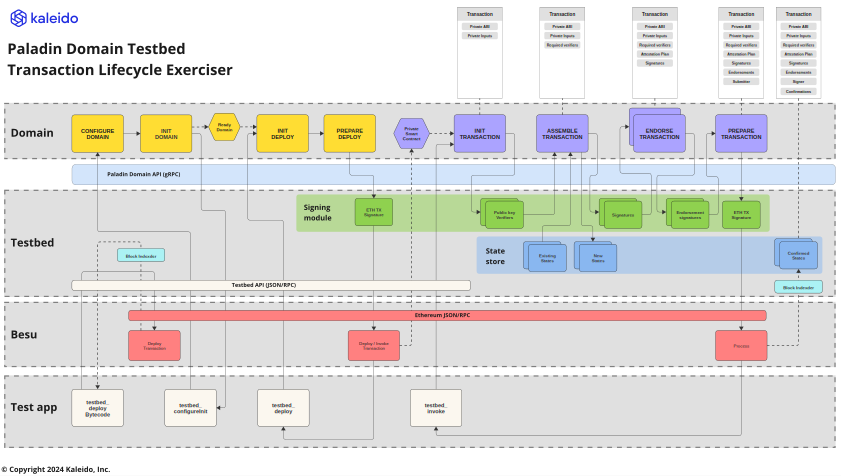

# Paladin Domain Testbed - Transaction Lifecycle Exerciser

The testbed allows you to drive the end-to-end lifecycle of your domain using the standard
domain API of Paladin, and the standard components of Paladin, but in isolation from the
distributed transaction engine.

This ideal for development and automated integration testing of how your domain
behaves in various simulated situations.

Components started by the Testbed and customizable via the configuration are:
1. A state store using a database
    - Default is SQLite in memory
2. A single signing module backed by a key store
    - Default is a BIP-32 HD Wallet derived from a seed mnemonic in the config
3. A block indexer
    - Using the same database as the state store
4. A copy of your domain
    - TODO: Started and loaded using the domain manager as the full Paladin node
5. Transaction lifecycle manager
    - TODO: Maintains the same state as a Paladin node, but runs inside the simulated engine
6. JSON/RPC test endpoint
    - Provides `testbed_` JSON/RPC commands for manual and automated testing of your domain
7. A full blockchain network connection
    - Default it to connect to Hyperledger Besu

## Getting started

> TODO: Details of how to run as a command line tool with your domain connecting via the
> standard Plugin interface of Paladin.